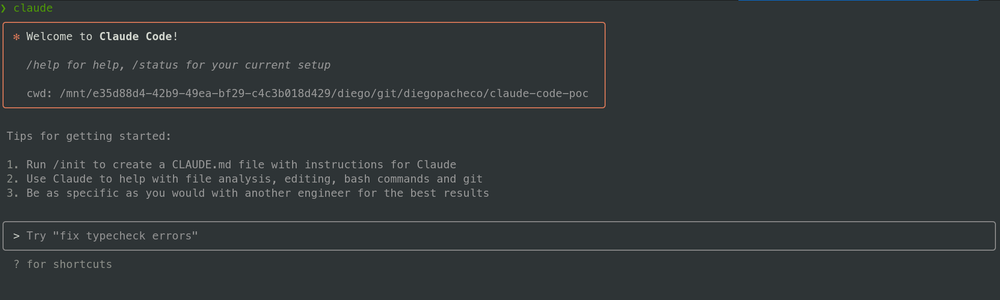
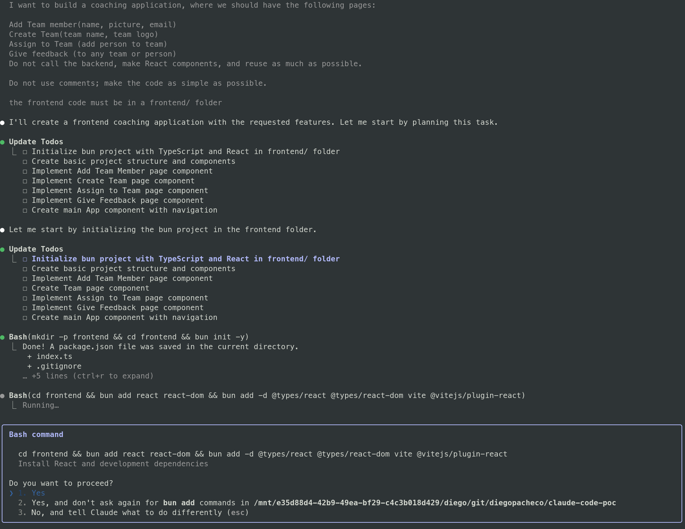
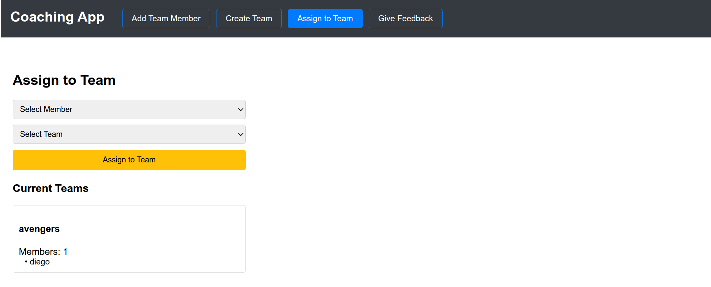
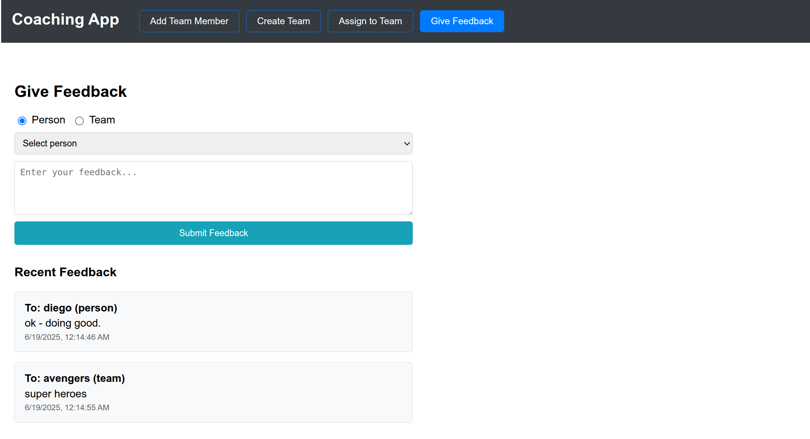

# NoSugar Coaching

A Simple Team Coaching App without sugar. <br/>
Claude-code-poc: POC using Claude code


## Features

* Create and manage team members
* Assign members to teams
* Provide feedback on team performance
* Provide feedback on people performance

## Results

Claude Code in action (my linux terminal)<br/>


Claude Code doing a task <br/>


Add team member <br/>


Create Team <br/>


Assign Team <br/>


Give Feedback <br/>


## Stack

* Frontend: React, TypeScript, Bun and Vite
* Backend: Go, Gin, Gorm, MySQL
* Database: MySQL running in a Docker container

## Quick Start with Docker

### Prerequisites
- Docker and Docker Compose installed
- Ports 3000, 8080, and 3306 available

### Start the Full Stack
```bash
# Clone and navigate to the project
git clone <repository-url>
cd claude-code-poc

# Start all services (MySQL, Backend, Frontend)
./start.sh

# Or start with clean database
./start.sh --clean
```

### Service URLs
- **Frontend**: http://localhost:3000
- **Backend API**: http://localhost:8080/api/v1
- **MySQL Database**: localhost:3306

### Available API Endpoints
- `GET /api/v1/members` - List all team members
- `POST /api/v1/members` - Create a new team member
- `GET /api/v1/teams` - List all teams
- `POST /api/v1/teams` - Create a new team
- `POST /api/v1/assign/:teamId/:memberId` - Assign member to team
- `POST /api/v1/feedback` - Submit feedback

### Docker Commands

```bash
# View logs
docker-compose logs -f

# Stop all services
docker-compose down

# Rebuild and start
docker-compose up --build

# Access MySQL directly
docker-compose exec mysql mysql -u coaching_user -pcoaching_password coaching_app
```

## Development

This POC was developed using Claude Code(https://www.anthropic.com/claude-code), AI Engineering agent that can help you to develop software. <br/>

PROS

* It's running in your local machine.
* It tells you how many tokens are being used.
* Because is local machine, it gets the tasks done a bit faster then Codex and a LOT faster Jules.
* When I give a task to add tests, added both unit and integration tests.
* When I give a task to add tests it also run the tests, catch some bugs on the tests and fixed them.
* Claude code used only ~30% CPU, I have 64 GB of ram, I have 64GB of ram, claude of using 0.6%(384 MB).
* Even with missing 3 tasks to be done(when I run out of tokens) the app was working.
* The code is pretty good, better than Codex and far superior then Jules.

CONS

* Does not run on a isolated/docker env(like Codex or Jules).
* Does not open PRs on GitHub automatically.
* > can you keep coding? (I was in the middle of task 5 and I used all my tokens)
  ⎿  Claude usage limit reached. Your limit will reset at 4am (America/Los_Angeles).
* Tokens run out pretty fast - I still would need 3 more tasks(missing list feedback and manage team pages/backeend) to finish the app.
* My tokens expire about in 1h coding.

### Tokens Usage

I asked claude about token usage and estimates based on tasks, I got this:

```
1. Rule of Thumb Approximations

English text: ~4 characters = 1 token
Code: ~3-4 characters = 1 token (varies by language)
Average word: ~1.3 tokens per word

2. Task Complexity Estimators
Simple tasks (100-500 tokens):

"Fix this syntax error"
"Add a comment to this function"
"Rename a variable"

Medium tasks (500-2,000 tokens):

"Implement a basic function"
"Debug this error message"
"Refactor this code block"

Complex tasks (2,000-10,000+ tokens):

"Implement user authentication"
"Create a REST API endpoint"
"Debug a multi-file issue"

Token Costs by Model
Claude Sonnet 4 (current model):

Input: ~$3 per million tokens
Output: ~$15 per million tokens

Estimation Example:

Medium task (~2k input + 1k output tokens) ≈ $0.021
Complex task (~5k input + 3k output tokens) ≈ $0.060
```

### Related POCs

* OpenAI Codex POC https://github.com/diegopacheco/codex-poc
* Google Jules https://github.com/diegopacheco/google-jules-poc
* Cursor POC https://github.com/diegopacheco/docker-cleanup
