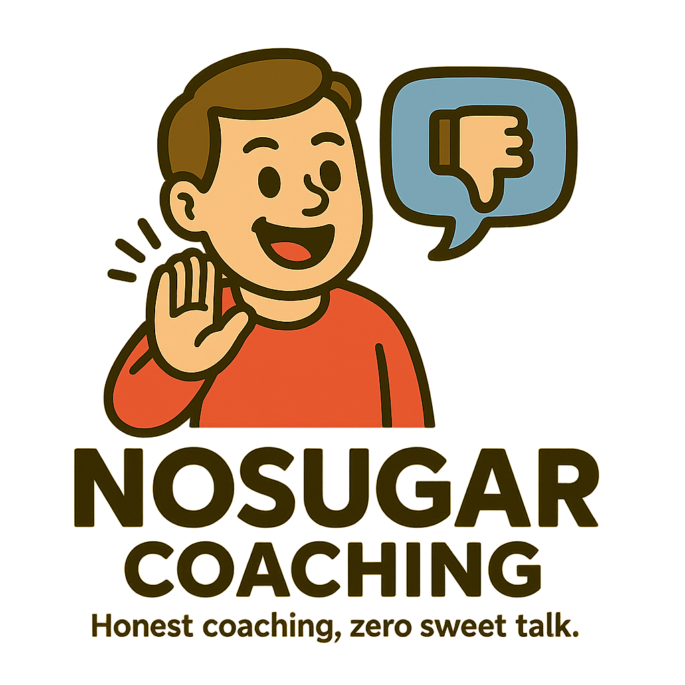

# NoSugar Coaching

A Simple Team Coaching App without sugar.  
Claude-code-poc: POC using Claude code

# Features

* Create and manage team members
* Assign members to teams
* Provide feedback on team performance
* Provide feedback on people performance

# Results

## Stack

* Frontend: React, TypeScript, Bun and Vite
* Backend: Go, Gin, Gorm, MySQL
* Database: MySQL running in a Docker container

## Developmement

This POC was developed using Claude Code(https://www.anthropic.com/claude-code), AI Engineering agent that can help you to develop software.  

PROS

CONS

### Related POCs

* OpenAI Codex POC https://github.com/diegopacheco/codex-poc
* Google Jules https://github.com/diegopacheco/google-jules-poc
* Cursor POC https://github.com/diegopacheco/docker-cleanup
